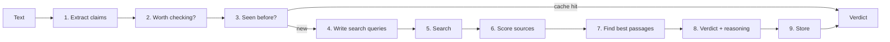

# Pramana

 

Pramana is a fact-checker you can paste a paragraph into. It finds the claims that can actually be checked, searches the web for evidence, and tells you for each one whether the evidence supports it, contradicts it, disagrees with itself, or just isn't enough to say. It shows its reasoning and links the sources it used.

The name comes from the Sanskrit word for a valid means of knowing something. That's roughly the question the project asks of every claim: what do we actually have to go on?

Everything runs on free tiers (Groq, Tavily, Supabase), so you can run it without paying for anything.

## Why I built it

<!-- Replace this paragraph with your own reason. Two or three honest sentences beat anything generic. -->
Most fact-checking demos hand a claim to a big model and print whatever comes back. I wanted something where you can see each step, swap any piece out, and measure it properly on public benchmarks, instead of trusting that it "seems to work".

## What it does

Give it text like this:

> NASA launched Artemis I on November 16, 2022, and it carried a crew of four astronauts.

It splits that into two separate claims, checks each one, and returns something like this for the first:

```json
{
  "claim": "NASA launched Artemis I on November 16, 2022.",
  "verdict": "SUPPORTED",
  "confidence": 0.93,
  "explanation": "Source [1] and source [2] both give 16 November 2022 as the launch date...",
  "cited_source_urls": [
    "https://www.nasa.gov/...",
    "https://www.reuters.com/..."
  ],
  "evidence_strength": 0.57
}
```

The second claim (crew of four) should come back as contradicted, since Artemis I flew without astronauts. Whether it does depends on what the search turns up, which is exactly why every verdict carries its sources and a strength score instead of just a label.

## How it works



A few decisions worth explaining, because they're the interesting part:

**One call to split the text, not four.** An early version made four separate LLM calls just to pull claims out of a paragraph, and it was painfully slow. Now a single structured call picks the checkable sentences, resolves pronouns ("he", "the company"), and breaks compound sentences into single facts.

**Opinions never reach the search step.** "Democracy is the best system" isn't something evidence can settle. A small classifier drops opinions, predictions and vague statements early, which saves API calls and avoids confident nonsense.

**Source trust is a lookup table, not a model.** A `.gov` or `.edu` domain scores higher than an unknown blog, and known disinformation sites score very low. It's crude on purpose: it's deterministic, free, and easy to argue with. It also means a wrong government page or a right small blog will be misjudged, and I'd rather that limitation be visible than hidden inside a model.

**Only three passages reach the final model.** Pages are scraped, split into chunks, and ranked against the claim by a local cross-encoder. The verifier sees the top three, not whole web pages. The last step also has to cite which numbered source it used, and if it claims SUPPORTED or CONTRADICTED without citing anything valid, the verdict is downgraded to INSUFFICIENT_EVIDENCE.

**`evidence_strength` tells you how much to trust the verdict.**

```
evidence_strength = average(trust score of cited sources) × min(1, number of cited sources / 3)
```

One good source gives a low score. Three or more good sources that agree give a high one. Two passages from the same site count as one source.

**Repeated claims are free.** Each verified claim is stored with an embedding. If a new claim is close enough in meaning to one already checked, the cached verdict is returned and no search or LLM calls happen.

## Getting started

You need Python 3.11 or newer and two free API keys: [Groq](https://console.groq.com/keys) and [Tavily](https://tavily.com). A database is optional.

```bash
git clone https://github.com/lqkshy/Pramana.git
cd Pramana

python -m venv .venv
.venv\Scripts\activate          # Windows
# source .venv/bin/activate     # macOS / Linux

pip install -r requirements.txt
cp .env.example .env            # Windows: copy .env.example .env
```

Open `.env` and add your keys, then start the server:

```bash
uvicorn app.main:app --reload
```

Interactive docs are at http://localhost:8000/docs. Or from the terminal:

```bash
curl -X POST http://localhost:8000/verify \
  -H "Content-Type: application/json" \
  -d '{"text": "NASA launched Artemis I on November 16, 2022."}'
```

The first request is slow because two small models (about 170 MB) download once and are then cached.

### Configuration

| Variable | What it does |
|---|---|
| `GROQ_API_KEY`, `TAVILY_API_KEY` | Your free keys. |
| `LLM_PROVIDER` | `groq` by default. `gemini`, `anthropic`, `openai` and `ollama` are also wired up. |
| `DEV_MODE` | `true` runs the verdict step on Llama 3.1 8B, which has a large daily limit and is fine for development. `false` uses Llama 3.3 70B, which reasons better but only allows about 1,000 requests a day. |
| `USE_LIVE_SEARCH` | `false` uses evidence supplied by a dataset instead of searching. The API server always turns this on. |
| `DATABASE_URL` | Optional Supabase/Postgres URL. Without it, the claim cache lives in memory and resets on restart. |

Two of these exist because of free-tier limits. Tavily gives 1,000 searches a month, so benchmarks use the evidence that ships with each dataset instead of spending that quota. And the split between the 8B and 70B models is there so a long debugging session doesn't use up the good model's daily allowance.

## Tests

```bash
pytest -v
```

The suite runs offline. Tests that need real API keys, or the embedding model, skip themselves when those aren't available. There's also an end-to-end test of the `/verify` endpoint with every external call mocked, so you can check the whole pipeline wiring without spending any quota.

## Project layout

```
app/
  main.py                 FastAPI app: /health and /verify
  pipeline/
    claims/extractor.py   stage 1
    check_worthiness.py   stage 2
    claim_matching.py     stage 3
    queries.py            stage 4
    retrieval.py          stage 5
    evidence.py           stage 7 (scrape and refine)
    reranking.py          stage 7 (chunk and rank)
    verification.py       stage 8
  services/
    llm_client.py         one interface over five LLM providers, with rate limiting
    source_trust.py       stage 6
  models/
    schemas.py            Pydantic models
    database.py           SQLAlchemy + pgvector
evaluation/               benchmark code (in progress)
tests/
```

## Where things stand

The full pipeline runs end to end. What I have not done yet is measure it, and I'd rather say that plainly than imply otherwise.

- [x] All nine stages implemented and wired into `/verify`
- [x] Offline test suite, including a mocked end-to-end run
- [ ] Benchmark on [AVeriTeC](https://fever.ai/dataset/averitec.html) and compare against published results
- [ ] Benchmark on [SciFact](https://github.com/allenai/scifact)
- [ ] A hand-labelled set of real-world claims to test live search
- [ ] Web frontend (Next.js)
- [ ] Hosted demo

## Known limitations

- **Small models make mistakes.** Development mode uses an 8B model. It's good enough to test the plumbing, not to trust for accuracy.
- **Scraping is best-effort.** Paywalled pages and pages that build their content with JavaScript often come back empty, and the pipeline falls back to the short search snippet.
- **Domain trust is a blunt tool.** See above.
- **The claim cache can be too eager.** Two claims that differ only in a number can look very similar to an embedding model. The similarity threshold is adjustable (`CLAIM_MATCH_THRESHOLD`) and I'd like to add an explicit number check.
- **English only**, and it's tuned for factual claims about the world, not opinions, satire or claims about the future.

## Contributing

Issues and pull requests are welcome, especially new benchmark loaders, better trust rules, and bug reports with the claim that broke it. If you're changing behaviour, please add or update a test.

## License

MIT. See [LICENSE](LICENSE).
