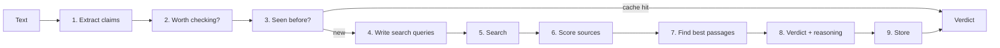

# Pramana

 

Pramana is a fact-checker AI. You can just paste a paragraph into. It finds the claims that can actually be checked, searches the web for evidence, and tells you evidence supports it, contradicts it, disagrees with itself, or just isn't enough to say. It shows its reasoning and links the sources it used.

That's roughly the question the project asks of every claim: what do we actually have to go on?

Everything runs on free tiers (Groq, Tavily, Supabase) and your on API

## Why I built it

<!-- Replace this paragraph with your own reason. Two or three honest sentences beat anything generic. -->
Most fact-checking demos hand a claim to a big model and print whatever comes back. I wanted something where you can see each step, swap any piece out, and measure it properly on public benchmarks, instead of trusting that it "seems to work".

## What it does

Give it text like this:

> NASA launched Artemis I on November 16, 2022, and it carried a crew of four astronauts.

It splits that into two separate claims, checks each one, and returns something like this for the first:

```json
{
  "claim": "NASA launched Artemis I on November 16, 2022.",
  "verdict": "SUPPORTED",
  "confidence": 0.93,
  "explanation": "Source [1] and source [2] both give 16 November 2022 as the launch date...",
  "cited_source_urls": [
    "https://www.nasa.gov/...",
    "https://www.reuters.com/..."
  ],
  "evidence_strength": 0.57
}
```

The second claim (crew of four) should come back as contradicted, since Artemis I flew without astronauts. Whether it does depends on what the search turns up, which is exactly why every verdict carries its sources and a strength score instead of just a label.

## How it works




**`evidence_strength` tells you how much to trust the verdict.**

```
evidence_strength = average(trust score of cited sources) × min(1, number of cited sources / 3)
```

**Repeated claims are free.** Each verified claim is stored with an embedding. If a new claim is close enough in meaning to one already checked, the cached verdict is returned and no search or LLM calls happen.

## Getting started

You need Python 3.11 or newer and two free API keys: [Groq](https://console.groq.com/keys) and [Tavily](https://tavily.com). A database is optional.

```bash
git clone https://github.com/lqkshy/Pramana.git
cd Pramana

python -m venv .venv
.venv\Scripts\activate          # Windows
# source .venv/bin/activate     # macOS / Linux

pip install -r requirements.txt
cp .env.example .env            # Windows: copy .env.example .env
```

Open `.env` and add your keys, then start the server:

```bash
uvicorn app.main:app --reload
```

Interactive docs are at http://localhost:8000/docs. Or from the terminal:

```bash
curl -X POST http://localhost:8000/verify \
  -H "Content-Type: application/json" \
  -d '{"text": "NASA launched Artemis I on November 16, 2022."}'
```

The first request is slow because two small models (about 170 MB) download once and are then cached.

### Configuration

| Variable | What it does |
|---|---|
| `GROQ_API_KEY`, `TAVILY_API_KEY` | Your free keys. |
| `LLM_PROVIDER` | `groq` by default. `gemini`, `anthropic`, `openai` and `ollama` are also wired up. |
| `DEV_MODE` | `true` runs the verdict step on Llama 3.1 8B, which has a large daily limit and is fine for development. `false` uses Llama 3.3 70B, which reasons better but only allows about 1,000 requests a day. |
| `USE_LIVE_SEARCH` | `false` uses evidence supplied by a dataset instead of searching. The API server always turns this on. |
| `DATABASE_URL` | Optional Supabase/Postgres URL. Without it, the claim cache lives in memory and resets on restart. |


## Known limitations

- **Small models make mistakes.** Development mode uses an 8B model. It's good enough to test the plumbing, not to trust for accuracy.
- **Scraping is best-effort.** Paywalled pages and pages that build their content with JavaScript often come back empty, and the pipeline falls back to the short search snippet.
- **Domain trust is a blunt tool.** See above.
- **The claim cache can be too eager.** Two claims that differ only in a number can look very similar to an embedding model. The similarity threshold is adjustable (`CLAIM_MATCH_THRESHOLD`) and I'd like to add an explicit number check.
- **English only**, and it's tuned for factual claims about the world, not opinions, satire or claims about the future.


## License

MIT. See [LICENSE](LICENSE).
